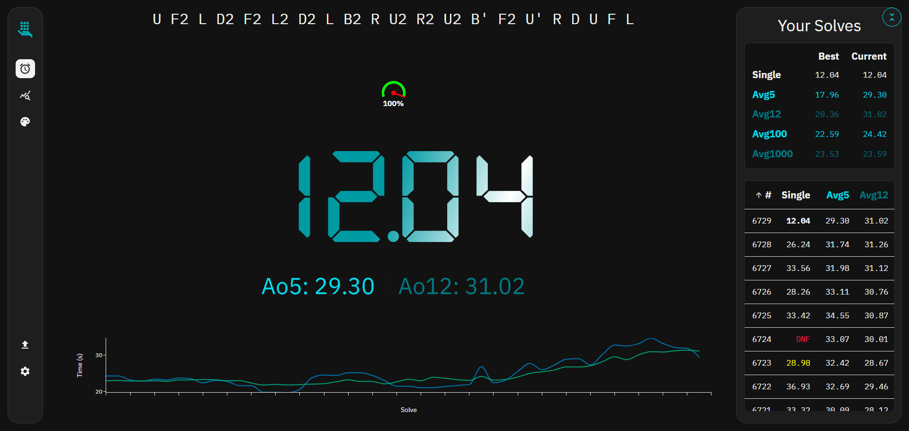
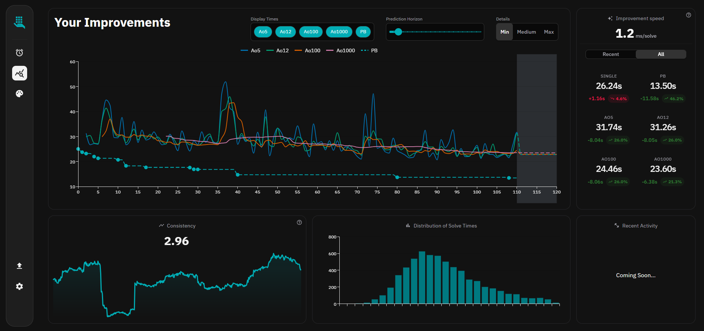

# Cosmic Cubing

A modern speedcubing timer and statistics platform for all WCA events. Track your solve times, analyze improvements, and visualize algorithms.

**Live at [cosmic-cubing.com](https://cosmic-cubing.com)**

## Screenshots

### Timer


Full-screen timer with scramble generation, live Ao5/Ao12 averages, and a mini solve-time chart. Responsive layout adapts to desktop and mobile.

### Statistics Dashboard


Detailed analytics including improvement trends (single, Ao5, Ao12, Ao100, Ao1000, PB), consistency tracking, solve time distribution, and development comparisons across recent vs. all-time performance.

## Features

- **Precision Timer** — spacebar-activated timer with WCA inspection support, +2/DNF penalties
- **All WCA Events** — 2x2 through 7x7, BLD, OH, FMC, Clock, Megaminx, Pyraminx, Skewb, Square-1
- **Statistics & Charts** — improvement graphs, distribution histograms, consistency metrics, PB tracking
- **Algorithm Visualizer** — interactive cube state preview with SVG/image export
- **Data Import** — import solves from csTimer and Cubic Timer
- **Sessions** — organize solves into sessions per discipline
- **Responsive** — dedicated desktop and mobile layouts

## Tech Stack

| Layer | Technology |
|-------|-----------|
| Frontend | React 19, TypeScript, MUI 7, Vite 7 |
| Backend | Express 5, Node.js, TypeScript |
| Database | PostgreSQL (via `pg`) |
| Shared | Zod schemas, shared types & enums |
| Monorepo | pnpm workspaces |

## Project Structure

```
packages/
├── frontend/      React SPA (Vite)
│   └── src/
│       ├── pages/           Timer, Statistics, AlgVis, Licenses
│       ├── components/      UI components (timer, stats cards, navigation, dialogs)
│       ├── contexts/        SolveContext, TimerSettingsContext
│       ├── hooks/           Solve management, local storage, timer logic
│       └── services/        API client
├── backend/       Express REST API
│   └── src/
│       ├── controllers/     Solve CRUD
│       ├── routes/          API routes
│       └── config/          Database config
└── shared/        Shared types, enums, Zod schemas
```

## Getting Started

### Prerequisites

- Node.js
- pnpm
- PostgreSQL

### Setup

```bash
# Install dependencies
pnpm install

# Start backend (from packages/backend)
pnpm dev

# Start frontend (from packages/frontend)
pnpm dev
```

The frontend dev server runs via Vite; the backend uses nodemon for hot reload.

## Author

**superhellth**

## License

UNLICENSED — All rights reserved.
